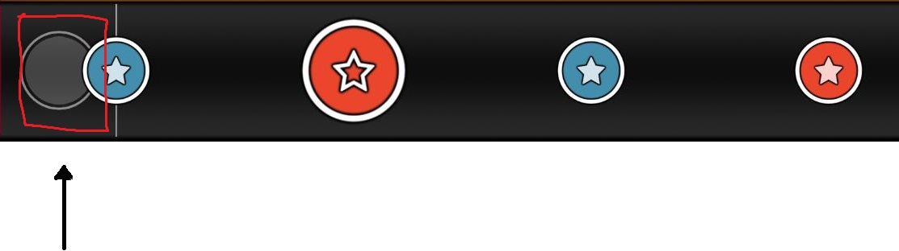
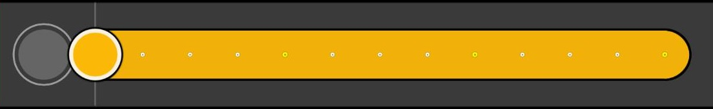

# 플레이

  

화살표가 가리키고 있는 부분을 **판정원**이라고 합니다. 음악에 맞춰서 노트가 판정원에 겹치는 순간, 해당 색에 맞는 키를 누르면 노트가 처리됩니다.

동에 해당하는 키와 캇에 해당하는 키가 각각 2개씩 있는데 둘 중 하나만 눌러도 됩니다. 큰 노트의 경우, 두 키를 동시에 누르면 점수가 2배로 들어갑니다.

  

**슬라이더**는 16분음표에 해당하는 속도로 연타하는것으로 처리가 가능합니다. 아무 키를 눌러도 되지만 박자를 정확하게 쳐야합니다.

  

스피너는 동과 캇을 번갈아 누르는 것으로 처리가 가능합니다.

kddk키배치의 경우, 예를들어 키 설정이 DFJK인 경우에, 4손가락으로 KJ DF KJ DF를 입력하면 빠른 처리가 가능합니다.
