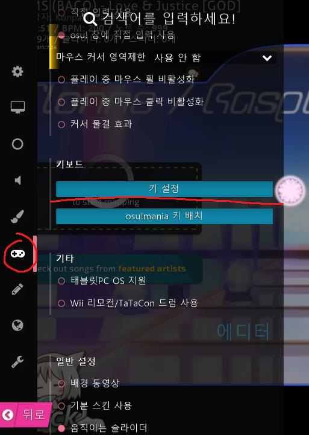
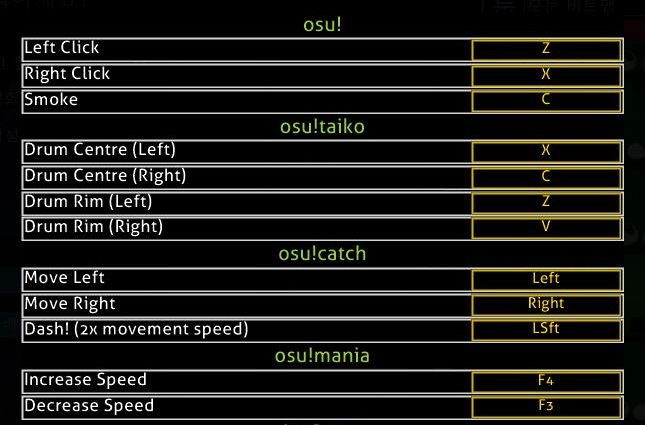

# 타법

처음에 태고를 시작하면 기본 키 설정이 ZXCV로 되어 있습니다. (ZV=캇, XC=동)

  

Ctrl + O키를 누른 후, 조이스틱 모양의 아이콘을 누른 다음, 키 설정 버튼을 클릭하면 아래 사진과 같이 키 설정을 변경할 수 있습니다.

  

키 설정을 DFJK로 바꾸거나 ZXNM 등으로 바꾸는 경우도 있습니다.

혹은 DFJK나 CVNM등 한 손에 색을 하나씩 부여하는 방식으로 키 설정을 바꾸는 경우도 있습니다.

왼쪽부터 동, 캇의 앞글자를 따와서 각각 kddk배치, kkdd 혹은 ddkk배치 라고 부릅니다.

키 배치마다 장단점이 존재하는데, kddk배치는 입문이 어려운 대신에 성장할 수 있는 한계점이 높고, kkdd배치는 입문이 쉬운 대신에 성장할 수 있는 한계점이 무척 낮습니다. 또한 kddk배치를 사용할 경우, 아케이드 태고를 할 때에도 도움이 됩니다.
