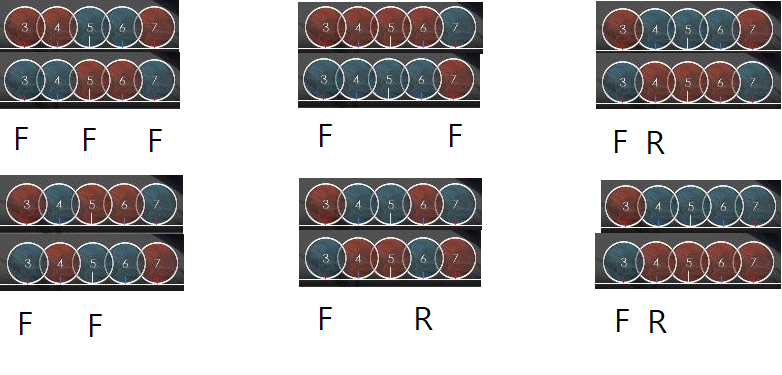

# N연타

Oni난이도는 주로 다양한 박자의 16비트 패턴으로 이루어져있습니다.
그 중 가장 기본적인 패턴이 3연타이고, 난이도가 올라갈수록 5연타, 7연타, 4연타, 2연타 등 여러 패턴이 등장하게 됩니다.

2연타는 dd, kk, dk, kd 4 종류가 있습니다.
치는데 큰 어려움은 없지만 dk와 kd를 양손을 이용해서 치는 연습을 하는것을 추천합니다.

4연타는 ooxx, oxxx, ooox 와 같이 2+2, 1+3, 3+1로 잘라서 읽은 다음 치는것이 정석입니다. 5연타 이상도 마찬가지입니다.

4연타의 경우, dddk, kkkd와 같은 패턴은 3연타를 치고 난 다음 반대손으로 마지막 노트를 치는 방식으로 처리합니다.

비슷한 방법으로 kddd, dkkk는 첫번째 노트를 치고나서 반대손으로 시작하여 나머지 3연타를 처리합니다.

dkkd의 경우에는 d + kkd 혹은 dkk + d 로 읽은다음 처리할 수 있고,
kddk의 경우에는 kdd + k 혹은 k + ddk 로 읽은다음 처리할 수 있습니다.

반대손으로 처리해야하는 이유는 노트를 홀수개로 분할하여 처리했기 때문입니다.

kkdd와 ddkk같은 경우는 kk+dd로 잘라서 읽는데, 이 경우에는 짝수개로 잘랐기 때문에 kk와 dd를 같은손으로 시작하여 처리하면 됩니다.

5연타도 비슷한 원리로, 자주 쓰이는 패턴을 예시로 들면

ddkkd -> dd + kk + d 혹은 dd + kkd
kkddk -> kk + dd + k 혹은 kk+ ddk

ddddk -> dd + ddk 혹은 dddd + k
kkkkd -> kk + kkd 혹은 kkkk + d

dkkkd -> d + kkk + d 혹은 dkkk + d
kdddk -> k + ddd + k 혹은 kddd + k

dkddk -> dk + ddk
kdkkd -> kd + kkd

dkkdk -> dkk + dk
kddkd -> kdd + kd

dkkkk -> d + kkkk
kdddd -> k + dddd

  

(F=시작손, R=반대손)

6연타 이후도 비슷한 방법으로 잘라서 읽은 뒤 그대로 처리하시면 됩니다.

잘라서 읽는것은 앞으로도 정말 중요한 기술이니 연습을 많이 하면 좋습니다.
