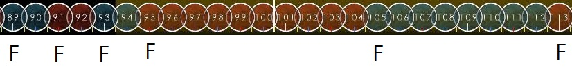
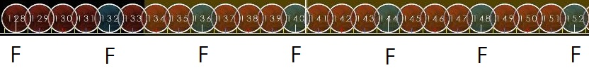
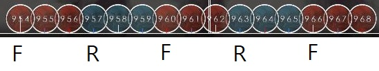
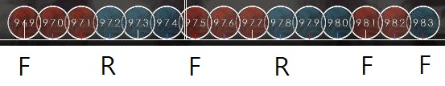
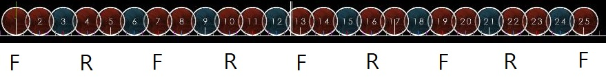
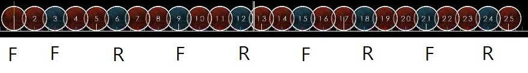
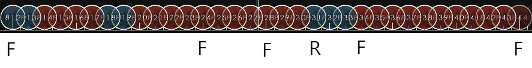
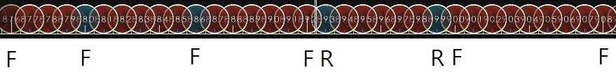

# 스트림

이 문단은 Oni난이도를 수월하게 처리할 수 있는 실력을 쌓고 읽는것을 추천합니다.

스트림 패턴은 동일한 박자의 노트가 길게 연달아서 나오는 패턴입니다.

스트림을 처리하는 방법은 위에 설명했던 방식대로 잘라서 읽고 처리하는 것입니다.

스트림의 종류로는 노트를 짝수개씩 잘라서 읽을수 있는 짝수 스트림, 홀수개씩 잘라서 읽을 수 있는 홀수 스트림, 3연타가 이어서 나오는 3연타 스트림, 모든 패턴이 복합적으로 나오는 복합 스트림이 있습니다.

## 짝수 스트림

짝수 스트림의 특징으로는, 색이 바뀔 때 시작하는 손이 바뀌지 않는 점입니다.

짝수 스트림이 나오는 대표적인 패턴은 Yawaraka Sensha가 있습니다.\
<https://osu.ppy.sh/beatmapsets/888125#taiko/1856464>

  

전부 짝수개의 연타로 이루어져있으므로 색이 바뀌는 모든 시작점은 시작손으로 치면 됩니다.

  

중간에 1 + 3 기차가 있어서 홀수 스트림이라고 생각될 수 있지만, 패턴의 주기가 4이므로 짝수 스트림입니다.

각 손마다 어떻게 쳐야할지 분석해보면, 오른손으로는 d d k d k d k d 를 치면 되고, 왼손으로는 동만 치면 됩니다.

## 홀수 스트림

홀수 스트림의 특징으로는, 색이 바뀔 때 동을 오른손으로 시작했다면 캇은 반드시 왼손으로 시작한다는 점입니다.

홀수 스트림이 나오는 대표적인 패턴은 Kurenai가 있습니다.\
<https://cdn.discordapp.com/attachments/810468542436212797/810799276862341130/X_JAPAN_-_Kurenai.osz>

  

이 패턴은 ddd를 치고나서 바로 다음으로 반대손으로 kkk 그리고 원래손으로 ddd를 치는것을 반복하면 됩니다.

  

이 패턴은 위의 패턴을 두번 반복한 다음 맨 마지막에 ddk를 치면 됩니다.

### 3연타 스트림

3연타 스트림은 반대손으로 3연타를 치는것을 연습하지 않으면 처리하기가 까다롭습니다.

3연타 스트림이 나오는 대표적인 패턴은 아래와 같습니다.\
<https://osu.ppy.sh/beatmapsets/22699#taiko/78390>\
<https://osu.ppy.sh/beatmapsets/28609#taiko/114207>\
<https://osu.ppy.sh/beatmapsets/40233#taiko/128791>\
<https://osu.ppy.sh/beatmapsets/697523#taiko/1477485>\

  

ddk가 계속해서 반복되는 스트림입니다. 3개씩 잘랐으므로, 시작손으로 ddk를 처리후, 바로 이어서 반대손으로 ddk를 처리하고 이것을 반복하면 됩니다.

  

캇에 초점을 맞춰서 이렇게 읽는 방법도 있습니다. 노트 두개를 먼저 치고 나서 시작손으로 kdd를 처리후, 바로 이어서 반대손으로 kdd를 처리하고 반복한 다음, kd를 칩니다.

## 복합 스트림

복합 스트림은 정해진 패턴이 없어서 치기 무척 까다롭습니다. 잘라서 읽는 것에 숙달되거나, 외워서 하는 방법 말고는 없습니다.

홀수개로 잘랐을 경우 다음 노트는 반대손으로, 짝수개로 잘랐을 경우 다음 노트는 같은 손으로 시작합니다.

같은 색으로 길게 섞여서 나올 경우 홀수 짝수 구분이 어려운 경우가 있습니다.
그럴 때에는 정박자로 시작하는지 엇박자로 시작하는지, 그리고 정박자로 끝나는지 엇박자로 끝나는지를 알고있으면 패턴을 파악하는데 도움이 됩니다.

정박자에서 시작해서 정박자로 끝나거나 엇박자로 시작해서 엇박자로 끝나는 경우는 모두 홀수입니다.

정박자에서 시작해서 엇박자로 끝나거나 엇박자로 시작해서 정박자로 끝나는 경우는 모두 짝수입니다.

   

웬만해선 이런 패턴은 잘 사용되지 않지만, 만약 이러한 패턴이 보일 경우 마디선을 잘 보아야 합니다.

개수를 일일이 세지 않아도 해당 노트가 정박자에 있는지, 엇박자에 있는지 알고있으면 그 노트를 어느손으로 쳐야하는지 바로 계산할 수 있습니다. (해당 패턴은 핵폐기물이라는 별명으로 유명한 맵에서 가져온 것. <https://osu.ppy.sh/beatmapsets/20125#taiko/93266>)

<https://osu.ppy.sh/beatmapsets/1014955>\
N연타 연습에 도움이 되는 맵팩입니다,

<https://docs.google.com/spreadsheets/d/1LWA0fFITTHOd4vorUxNhERb_4ukYqzcMdu03wpXcpSE/edit#gid=278022392>\
스트림 연습에 도움이 되는 맵 리스트입니다.
