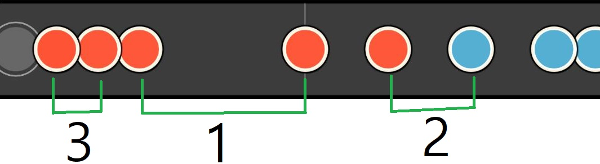
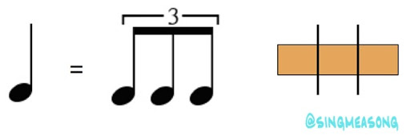
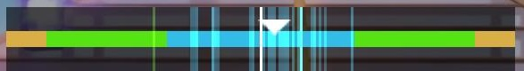
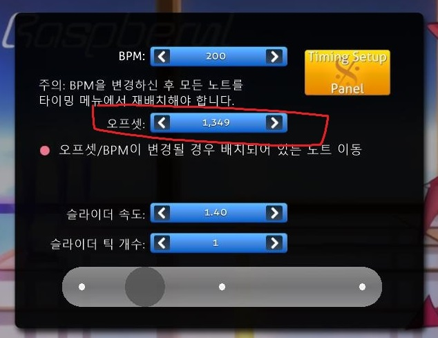

# 고급

이 파트는 어느정도 숙련된 사람이 읽는것을 추천합니다. 이 단원을 넘기고 싶으시다면 다음 장으로 넘어가셔도 괜찮습니다.

## 비트

  

**n비트**(4비트, 8비트 등)은 n분음표를 뜻합니다. 즉 4비트는 4분음표만큼의 간격입니다. 위 그림에서 1에 해당하는 간격은 4비트, 2에 해당하는 간격은 8비트, 3에 해당하는 간격은 16비트 입니다.

  

12비트의 경우, 4비트를 3개로 나눈 박자입니다.

4분음표는 한 박자 라고도 표현하는데, (8분음표는 반 박자) 4분음표를 1/1, 8분음표를 1/2, 16분음표를 1/4 로 표현하는 경우도 있습니다. (12비트는 1/3)

## 연타

  

**연타**(2연타 3연타 등)는 같은 간격의 노트가 2개 이상 연달아 오는 패턴을 의미합니다. 위의 사진은 각각 3연타, 3연타, 5연타 입니다. 영어로는 2연타는 Doublet, 3연타는 Triplet, 그 이상은 N-plet 혹은 N-tuple 혹은 N Tuplet이라고 부릅니다. (주로 N-plet이 사용됨) (부정확함)

## 스트림

  

**스트림**입니다. **기차**라고도 부릅니다. 같은 간격의 노트가 긴 시간동안 연달아 오는 패턴을 의미합니다. 영어로는 Stream이라고 합니다.

  

**복합스트림** 입니다. **복합 기차**라고도 부릅니다. 스트림 패턴에 추가적으로 박자가 바뀌는 경우 복합 스트림이라고 부릅니다.

## 판정 오차 미터

  

**판정 오차 미터**입니다. 노트를 빠르게 처리한 경우 왼쪽에, 느리게 처리한 경우 오른쪽에 선이 표시됩니다.

## 오프셋

  

**오프셋**입니다. 곡의 시작지점입니다. 만약 판정 오차미터가 한 쪽으로 쏠린 경우, -키와 +키를 이용하여 오프셋을 조절할 수 있습니다. 왼쪽으로 쏠린 경우 -키, 오른쪽으로 쏠린경우 +키를 사용하여 조절할 수 있습니다. alt키와 -키를 동시에 눌러서 1ms단위로 조절할 수 있습니다.
