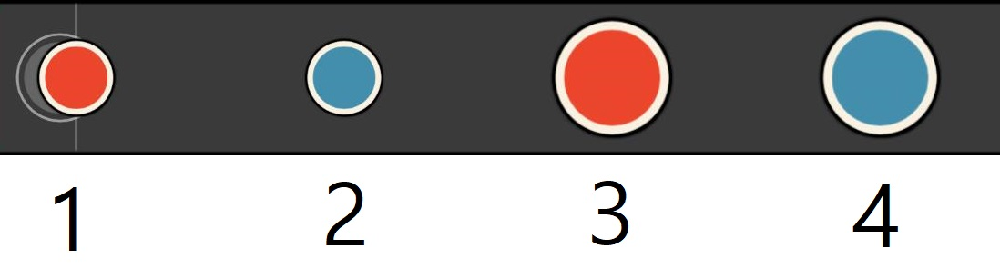
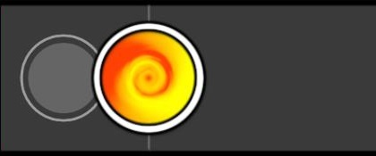
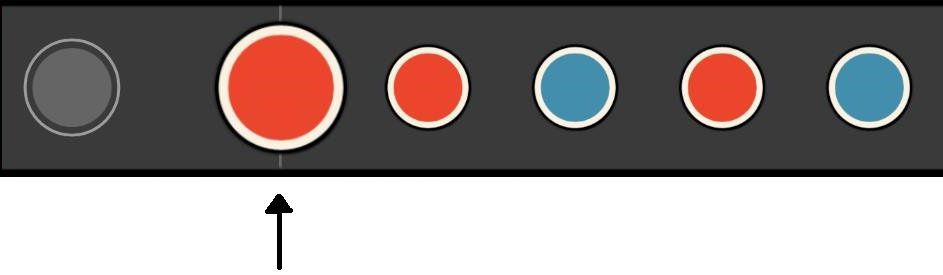
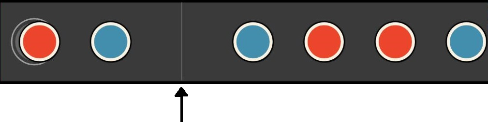
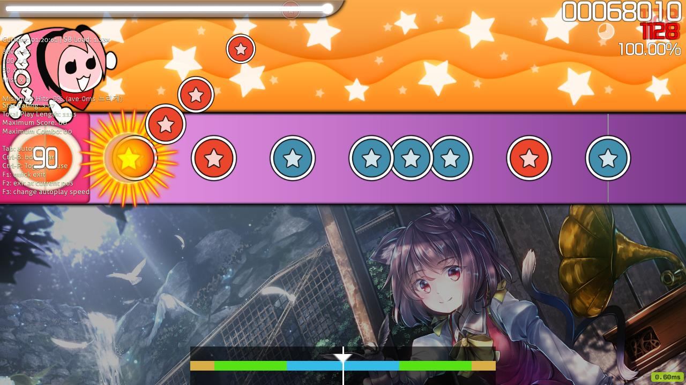

# 기초

  

빨간색 작은 원은 **동**이라고 부릅니다. 일본어로 ドン이라 부르고 영어로는 don(줄여서 d)이라고 합니다. 파란색 작은 원은 **캇**이라고 부릅니다. 일본어로 カッ이라 부르고 영어로는 kat(줄여서 k)이라고 합니다. 1, 2번과 같은 작은 원들을 **노트**라고도 부릅니다. 일본어로는 音符, 영어로는 Note라고 합니다.

빨간색 큰 원은 **큰 동**이라고 부릅니다. 파란색 큰 원은 **큰 캇**이라고 부릅니다. 3, 4번과 같은 커다란 원들을 **큰 노트**라고도 부릅니다. 일본어로는 大音符, 영어로는 Big Note 혹은 Finisher라고 합니다.

  

**슬라이더**입니다. 단무지라는 별명으로 불리기도 합니다.일본어로는 연타(連打)라고 불리고 영어로는 Slider라고 불립니다.

  

**스피너**입니다. 뎅뎅이라고 부르는 경우도 있습니다. 일본어로도 마찬가지로 스피너(スピナー), 영어로도 Spinner 입니다.

   

**마디선**입니다. 각 마디의 첫 부분에 나타나는 선 입니다. 위쪽 사진에서는 큰 동 뒤에 있습니다. 일본어로는 소절선(小節線)이라고 하고 영어로는 Bar Line 이라고 합니다.

  

**키아이 타임**입니다. 고고타임이라고 부르는 경우도 있습니다. 일본어로도 キアイタイム 혹은 ゴーゴータイム이라 하고, 영어로는 Kiai Time 이라 합니다. 스킨에 따라 다르지만, 기본 스킨 기준으로 캐릭터가 춤을 추며 플레이 필드가 밝아집니다. 해당 구간에서는 모든 점수가 1.2배가 됩니다.
